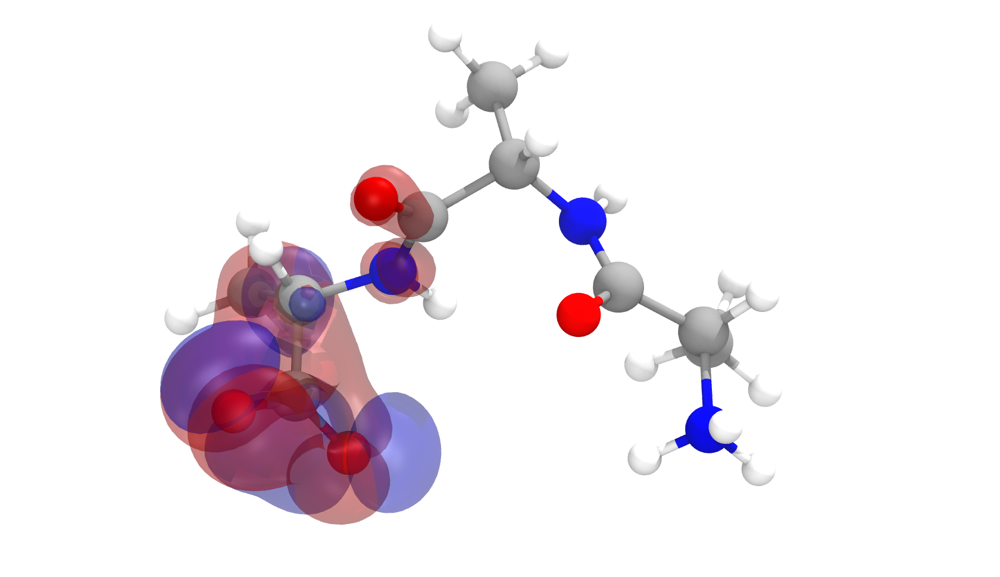

# NAMD QM/MM Tutorial: Advanced Module
# Free Energy Profile of Reaction Mechanisms

This tutorial provides a detailed methodology of how to prepare, run and analyze
complex QM/MM simulations. In real-life applications, it is usual to find
molecular complexes that have not had their 3D structure experimentally determined.
You will learn how to make use of a similar structure available in
the PDB, mutate the ligand of interest, and set up Steered Molecular Dynamics
(MD) simulations that use both classical and quantum mechanical calculations.
From there, you will learn how to select representative stages of a chemical reaction,
and prepare a String-Method optimization of the reaction coordinate. The
optimized path will then be used to run an extended ABF (eABF) simulation
that calculates the free energy change along the reaction.

You should start with the document found in the `Tutorial_PDF` folder. This tutorial assumes you have besic knowledge of **VMD** and **NAMD**, and have the latest versions of both software installed. We also assume you have a working installation of **Python** (version >= 3.5). The last assumption is that you are working in a **Linux** or **MacOS** system.

## Requirements

- NAMD, VMD, Python (of course).

The following packages are needed for the notebook portion of the tutorial:

- jupyeter mdanalysis numpy pandas plotnine matplotlib ipywidgets

They can be easily installed using the following command (this will install all packages in your user's *local packages*, but you can change that for a **conda** or **venv** installation):

- `pip3 install --user jupyter mdanalysis numpy pandas plotnine matplotlib ipywidgets`

In order for widgets to run correctly in the notebook, you must run:

- `jupyter nbextension enable --py --user widgetsnbextension`  (for user instalation)

or 
 
- `jupyter nbextension enable --py --sys-prefix widgetsnbextension`  (for system-wide instalation)

Pre-ran example outputs are packaged with the tutorial to allow users to go through the preparation and analysis, skipping the computationally expensive and time consuming simulations. Since large files aer no efficiently stored in GitHub, we use git Large File Storage ([git-lfs](https://git-lfs.github.com/)) to store them. You can learn more about it in [this YouTube video](https://www.youtube.com/watch?v=uLR1RNqJ1Mw).

**Before** cloning this tutorial with git, [install git-lfs](https://git-lfs.github.com/) to allow git to download pre-ran DCD files of example outputs.

